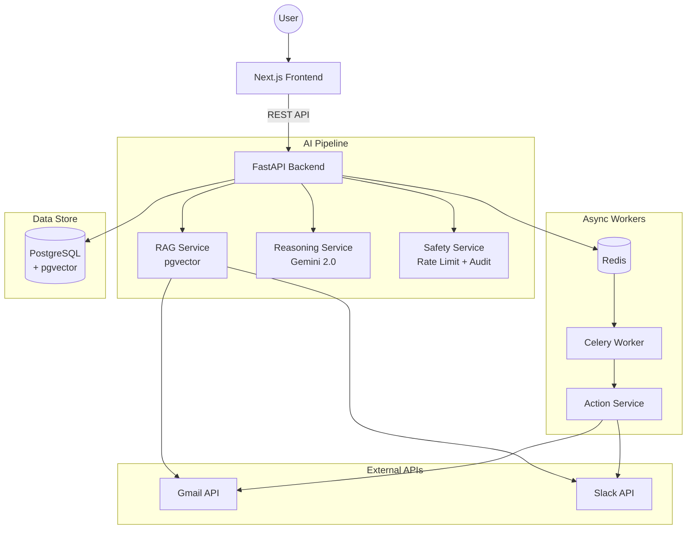

# DreamCatcher 🌙

<div align="center">
  <h3>🤖 Your Autonomous AI Executive Assistant</h3>
  <p><strong>Proactive. Privacy-First. Safety-First.</strong></p>
  <p>AIがあなたの代わりに考え、提案し、承認を得てから行動する「自律型AIライフマネージャー」</p>

  <p>
    
    
    
    
    
    
  </p>
  
  <p>
    <a href="https://zenn.dev/ibukinagase/articles/1ceb282e68031a">
      
    </a>
  </p>
</div>

---

## 🎯 What is DreamCatcher?

DreamCatcher is not just another task manager. It's an **Autonomous AI Agent** that:

1. 📥 **Ingests your context** - Gmail, Slack, Google Calendar
2. 🧠 **Thinks proactively** - Identifies actions you should take
3. 📝 **Proposes actions** - "Reply to this email", "Create this task"
4. ✅ **Waits for your approval** - Never acts without permission
5. ⚡ **Executes safely** - Sends emails, posts to Slack, creates tasks

> **"Your AI assistant that proposes, but never acts without your permission."**

---

## 🚀 Key Features

### 🤖 Autonomous Agent Loop
- **RAG Pipeline**: Ingests Gmail, Slack, Calendar into vector database
- **Reasoning Engine**: Gemini 2.0 analyzes context and generates proposals
- **Human-in-the-Loop**: All external actions require explicit approval
- **Async Execution**: Celery workers handle background tasks

### 🛡️ Safety-First Architecture
- **Risk Classification**: Proposals labeled as low/medium/high risk
- **Rate Limiting**: Prevents runaway AI loops (Redis-backed)
- **Audit Logging**: Every AI decision recorded in `ActionLog`
- **Encrypted Tokens**: OAuth credentials encrypted at rest (Fernet)

### 🔌 Universal Integrations
| Service | Read | Write |
|---------|------|-------|
| Gmail | ✅ Emails | ✅ Drafts |
| Slack | ✅ Messages | ✅ Post |
| Google Calendar | ✅ Events | 🔜 Create |
| GitHub | ✅ Issues | 🔜 Create |
| Notion | ✅ Pages | 🔜 Create |

### 🎨 Modern UI
- **Next.js 15** with App Router
- **Framer Motion** animations
- **Dark Mode** first
- **PWA** ready

---

## 🏗️ Architecture



---

## 🛠️ Quick Start

### Prerequisites
- Docker & Docker Compose
- Google Gemini API Key

### Development Setup

```bash
# Clone
git clone https://github.com/naki0227/task-manager.git
cd task-manager

# Configure
cp .env.example .env
# Edit .env and add your GEMINI_API_KEY

# Start (Hybrid Mode: Backend in Docker, Frontend Local)
make dev
```

### Production Deployment

```bash
# Use production config (no volume mounts)
docker-compose -f docker-compose.prod.yml up -d
```

### Available Commands

```bash
make up        # Start all services
make dev       # Hybrid dev mode (Backend Docker + Frontend Local)
make logs      # View all logs
make shell     # Shell into backend container
make migrate   # Run DB migrations
make clean     # Stop and remove volumes
```

---

## 📁 Project Structure

```
├── frontend/           # Next.js 15 App
├── backend/
│   ├── app/
│   │   ├── routers/    # API endpoints
│   │   ├── services/   # Business logic
│   │   │   ├── llm/    # LLM abstraction (Gemini, OpenAI ready)
│   │   │   ├── reasoning.py   # AI proposal generation
│   │   │   ├── action.py      # Execution logic
│   │   │   └── safety.py      # Rate limiting, audit
│   │   └── worker.py   # Celery tasks
│   ├── prompts.yaml    # Externalized AI prompts
│   └── alembic/        # DB migrations
├── docker-compose.yml      # Development
├── docker-compose.prod.yml # Production
└── Makefile               # Developer shortcuts
```

---

## 🔐 Security

- **OAuth 2.0** for all integrations (Google, Slack, GitHub, etc.)
- **Token Encryption** using Fernet (AES-128)
- **Human-in-the-Loop** for all external actions
- **Rate Limiting** via Redis (Token Bucket algorithm)
- **Audit Trail** in `ActionLog` table

---

## 🧪 Testing

```bash
# Run integration tests
docker-compose exec -e MOCK_EXTERNAL_APIS=true backend python -m pytest tests/

# Run E2E tests
pytest e2e/
```

---

## 🗺️ Roadmap

### ✅ v2.0 (Current)
- [x] Autonomous Agent Core
- [x] Gmail / Slack Integration
- [x] Human-in-the-Loop Safety
- [x] LLM Abstraction (Gemini, OpenAI ready)
- [x] Prompt Registry (YAML-based)
- [x] Risk Classification & Audit Logging
- [x] Async Execution (Celery Workers)

### 🎯 v2.1 (Next)
- [ ] PWA Optimization (Service Worker, Offline Caching, Push Notifications)
- [ ] Voice Input for Mobile Approvals
- [ ] GitHub Integration (Issue Creation)
- [ ] Notion Integration (Page Creation)

### 🔮 v3.0 (Future)
- [ ] Webhook Support (External Triggers)
- [ ] Usage Analytics Dashboard
- [ ] Multi-language Prompts (EN/JA)
- [ ] Self-hosted LLM Option (Ollama)

---

## 🤝 Contributing

1. Fork the repository
2. Create your feature branch (`git checkout -b feature/amazing`)
3. Commit your changes (`git commit -m 'Add amazing feature'`)
4. Push to the branch (`git push origin feature/amazing`)
5. Open a Pull Request

---

## 📄 License

MIT License - see [LICENSE](LICENSE) for details.

---

<p align="center">
  <strong>🌙 DreamCatcher - Catch Your Dreams, Automate Your Life</strong>
  <br/>
  <small>© 2026 DreamCatcher Project</small>
</p>
