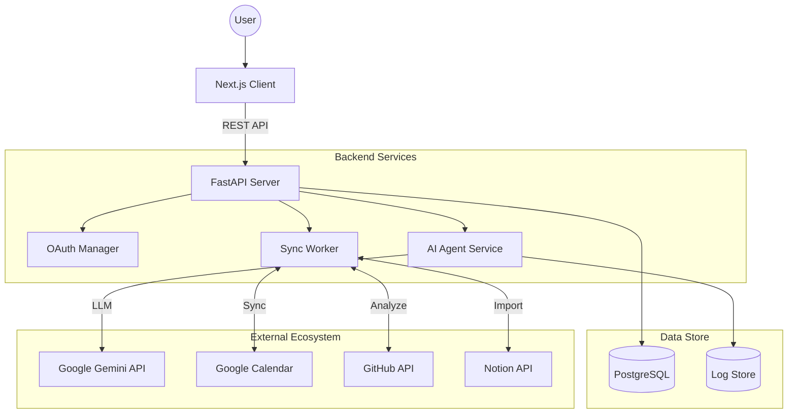

# DreamCatcher

<div align="center">
  <h3>"AI-Powered Autonomous Life OS"</h3>
  <p>自律型AIエージェントが、あなたの「夢」を具体的な「行動」に変えるタスク管理プラットフォーム</p>

  <p>
    
    
    
    
    
  </p>
</div>

---

## 📖 概要 (Overview)

DreamCatcher（ドリームキャッチャー）は、単なるToDoリストを超えた **「目標達成支援システム」** です。
ユーザーが抱く漠然とした目標（例:「フルスタックエンジニアになりたい」）を入力するだけで、生成AI (Google Gemini 2.5) が現状のスキルセットを分析し、実現までの具体的なロードマップと週間タスクを自動生成します。

従来のタスク管理ツールが「やるべきこと(Why/What)」の管理に留まるのに対し、DreamCatcherは **「どう実現するか(How)」までをエンジニアリングする** ことを目的としています。

---

## 🚀 技術的なこだわり (Technical Highlights)

本プロジェクトでは、モダンなWeb開発技術とAIの実践的な統合に注力しました。

### 1. Modern Frontend Architecture
- **Framework**: Next.js (App Router) を採用し、Server Componentsによるパフォーマンス最適化とSEO対策を実施。
- **UI/UX**: Tailwind CSS + Framer Motion により、直感的で流動的なインタラクションを実現。
- **State Management**: 複雑なタスク状態管理にはReact Queryを採用し、サーバー状態とUIの同期を効率化。

### 2. Scalable Backend & AI Integration
- **High Performance**: PythonのFastAPI (Asynchronous) を採用し、AI推論や外部API連携などのI/Oバウンドな処理を非同期で効率的に処理。
- **Function Calling**: Gemini APIのFunction Calling機能を活用し、チャットインターフェースから「タスク追加」「カレンダー確認」などのシステム操作を自然言語で実行可能に実装。
- **Robustness**: Pydanticによる厳格な型定義とバリデーションにより、AIの非決定的な出力をシステムが扱える構造化データに変換。

### 3. Data Sync & Integration
- **Hybrid Database**: ローカル開発時はSQLite、本番環境(Cloud)ではPostgreSQLにシームレスに切り替わるアーキテクチャ設計。
- **External APIs**: Google Calendar, GitHub, Slack, Notion等、多数の外部サービスとのOAuth認証・データ同期パイプラインを構築。

---

## ✨ 主な機能 (Core Features)

### 🎯 Dream Analysis Engine (夢分析エンジン)
ユーザーの「夢」と「現状」のギャップを埋めるためのステップを自動生成します。
- **スキル分析**: GitHubAPIを通じてコミットログを解析し、ユーザーの現在の技術スタックと熟練度を推定。
- **ギャップ分析**: 目標達成に不足しているスキルやリソースを特定。
- **プランニング**: 週間単位の具体的なアクションプラン（学習教材やプロジェクト案）を提示。

### 🧠 Autonomous Agent (自律エージェント)
チャットボットが単なる相談相手ではなく、実務を行うアシスタントとして機能します。
- 「来週の空き時間は？」→ Google Calendarを確認して回答。
- 「このタスクを登録して」→ データベースにTodoを作成し、必要に応じてSlack通知。

### ⏱️ Focus & Flow State Support
- **Focus Timer**: ポモドーロテクニックに基づいたタイマー機能。
- **Infinite Context Resume**: (Local Only) "あの作業をしていた状態" をスナップショットとして保存。ブラウザのタブセットやVS Codeのワークスペース状態をワンクリックで復元。

---

## 🏗️ アーキテクチャ図 (System Architecture)



---

## 🛠️ 開発環境のセットアップ (Getting Started)

ローカル環境での簡単な起動方法を記載します。

### 前提条件
- Docker & Docker Compose

### 起動手順
1. リポジトリをクローン
   ```bash
   git clone https://github.com/naki0227/task-manager.git
   cd task-manager
   ```
2. 環境変数の設定 (`.env.example` をコピー)
   ```bash
   cp .env.example .env
   # GEMINI_API_KEY のみを設定すれば最小構成で動作します
   ```
3. コンテナ起動
   ```bash
   docker-compose up --build
   ```
   - Frontend: http://localhost:3000
   - API Docs: http://localhost:8000/docs

---

## 🗺️ 将来の展望 (Roadmap)

現在、[GitHub Issues](https://github.com/naki0227/task-manager/issues) にて以下の機能開発を計画・進行しています。

- [ ] **Mobile Native App (React Native)**: 外出先でのタスク確認とプッシュ通知の実現 (#19)
- [ ] **VS Code Extension**: エディタ内でのタスク管理とコーディング時間の自動計測 (#20)
- [ ] **Offline-First**: RxDBを用いたローカルファーストなデータ同期基盤の構築 (#22)

---

<p align="center">
  <small>© 2026 DreamCatcher Project. MIT License.</small>
</p>
